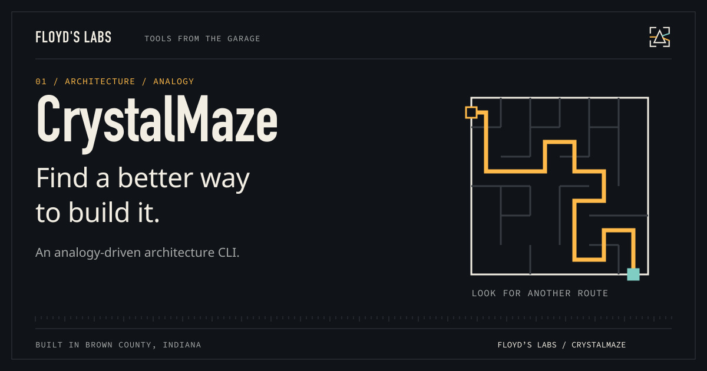

# CrystalMaze



**Architecture ideas from unexpected places.**

A dependency-free CLI and ESM library that maps architecture questions to cross-domain analogies and structured proposals. Built at Floyd’s Labs: one garage, two black cats, and tools that have to earn the desk space.

[Download v0.1.0](https://github.com/CaptainPhantasy/CrystalMaze/releases/tag/v0.1.0) · [Report a bug](https://github.com/CaptainPhantasy/CrystalMaze/issues) · [Floyd’s Labs](https://floyd-labs-proving-ground.captainphantasy.chatgpt.site/open-source)

## Get it running

Requirements: **Node.js 20 or newer**.

Download `crystalmaze-0.1.0.tgz` from the release, then install the actual package:

```sh
npm install -g ./crystalmaze-0.1.0.tgz
crystalmaze "Coordinate services without a central database"
crystalmaze --json --domain biology "Make a rate limiter resilient to distributed clients"
```

For the ESM library, use `npm install ./crystalmaze-0.1.0.tgz` and import `analyzeArchitectureProblem` from `crystalmaze`. It uses built-in patterns; it does not call a hosted model. Treat proposals as design input, then check them against your system's constraints.

## What is in the box

The release includes `crystalmaze-0.1.0.tgz`, source where applicable, and `SHA256SUMS.txt`. Use the tagged release's named assets for installation; GitHub's automatic source archives are snapshots. Verify a download with `shasum -a 256 -c SHA256SUMS.txt` after downloading the matching files.

## Show the work

`npm test`, `npm run build`, `npm run lint`, and `npm run e2e` exercise the library, syntax/build, metadata, and CLI. The release package is separately installed and run from a fresh directory.

## Contribute or get help

Open an issue with your platform, version, command, and a minimal reproduction. Keep credentials and personal transcripts out of reports. See [CONTRIBUTING.md](CONTRIBUTING.md) and [SECURITY.md](SECURITY.md).

## License

The repository has no open-source license granting redistribution rights. Existing restrictions are preserved; a public download does not change those rights.

---

Built with intent. Bella checks the keyboard. Bowser watches the router.
